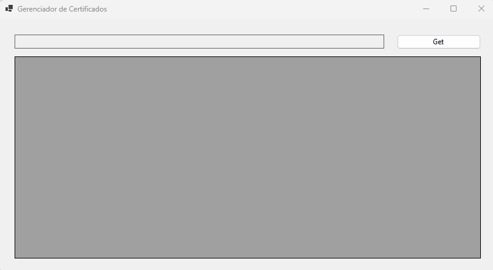
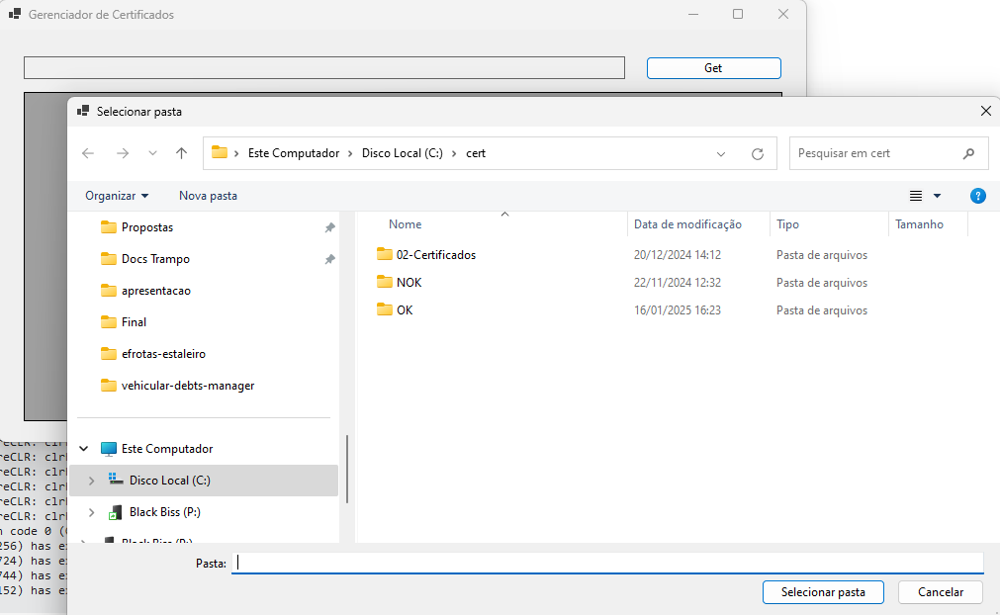
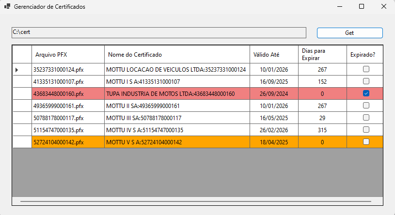

# 📋 Gerenciador de Certificados

Aplicação Desktop para visualizar, de forma rápida e organizada, certificados digitais `.pfx`, suas datas de expiração e status de validade.

## 🖥️ Requisitos

- Windows com .NET instalado (compatível com .NET 6+ ou o framework da aplicação)
- Certificados no formato `.pfx`
- Arquivo `.pwd` contendo a senha do certificado (mesmo nome do `.pfx`)

---

## 🧾 Como usar

1. **Organize os certificados**
   
   Coloque os arquivos `.pfx` dentro de uma pasta qualquer. Para cada certificado, crie um arquivo de senha com o **mesmo nome** e a extensão `.pwd`.

   **Exemplo de estrutura:**

   ```
   C:\cert\
   ├── empresa1.pfx
   ├── empresa1.pwd   ← contém a senha do .pfx em texto puro
   ├── empresa2.pfx
   ├── empresa2.pwd
   ```

2. **Abra a aplicação**

   - Execute o arquivo `Certtificates.Manager.exe` (ou conforme o nome da build).
   - Clique no botão **"Get"**.
   - Selecione a **pasta onde estão os certificados**.
   - O sistema irá listar automaticamente os certificados e suas informações.

---

## 📊 Informações exibidas

A tabela apresenta as seguintes colunas:

| Coluna               | Descrição                                                   |
|----------------------|-------------------------------------------------------------|
| Arquivo PFX          | Nome do arquivo `.pfx`                                      |
| Nome do Certificado  | Nome extraído do certificado digital                        |
| Válido Até           | Data de expiração do certificado                            |
| Dias para Expirar    | Dias restantes até a expiração                              |
| Expirado?            | Indica se o certificado já está vencido                    |

---

## 🎨 Cores da Tabela

- 🔴 **Vermelho Claro**: Certificado **vencido**
- 🟠 **Laranja**: Certificado que vence em **menos de 20 dias**
- ⚪ **Sem cor**: Certificado válido por mais de 20 dias

---

## ⚠️ Observações

- Certificados que **não possuem o arquivo `.pwd` correspondente** serão ignorados.
- Certificados com **senha incorreta ou inválida** não serão exibidos.
- Os dados **não são alterados** ou exportados – a ferramenta é apenas de **visualização**.

---

## 📸 Tela do sistema

### 01. Inicio



### 02. Escolha pasta



### 03. Listagem dos Certificados


